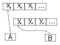
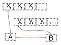
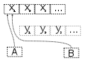
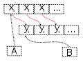
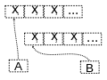

# CPP basic concepts #


## copy constructor ##
If a copy constructor is not defined in a class, the compiler itself defines one.If the class has pointer variables and has some dynamic memory allocations, then it is a must to have a copy constructor.
When initialize an object with another object of same class during its declaration, copy constructor will be called.
- **shallow copy**: The compiler will do shallow copy by default.  Only the object gets copied but not all the members of the class are copied.
- **deep copy**: when you have decided to implement copy constructor or overload assignment in your class and allows copying all the members of the class.

**Shallow:**

  

The variables A and B refer to different areas of memory, when B is assigned to A the two variables refer to the same area of memory. Later modifications to the contents of either are instantly reflected in the contents of other, as they share contents.

**Deep:**

  

The variables A and B refer to different areas of memory, when B is assigned to A the values in the memory area which A points to are copied into the memory area to which B points. Later modifications to the contents of either remain unique to A or B; the contents are not shared.

```C++
MyClass& MyClass(const MyClass& obj) // copy constructor for MyClass
{
}
MyClass& operator=(const MyClass& obj) // overloading assignment operator,
{
}
```

### What is Dangling Pointer in C++? ###
A pointer which is pointing to an invalid address is called dangling pointer. 
There is a chance of program crash due to dangling pointer.

## interface (abstract class) ##
a class with a pure virtual function can be termed as an abstract class in C++.
abstract class is a class with a pure virtual function;
- cannot create an instance of abstract class
- if derived class doesn't implement/overwrite pure virtual function of the base class, then derived class acts as an abstract class